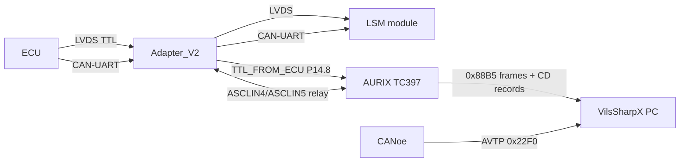
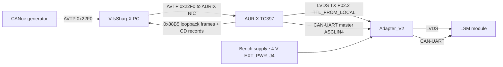
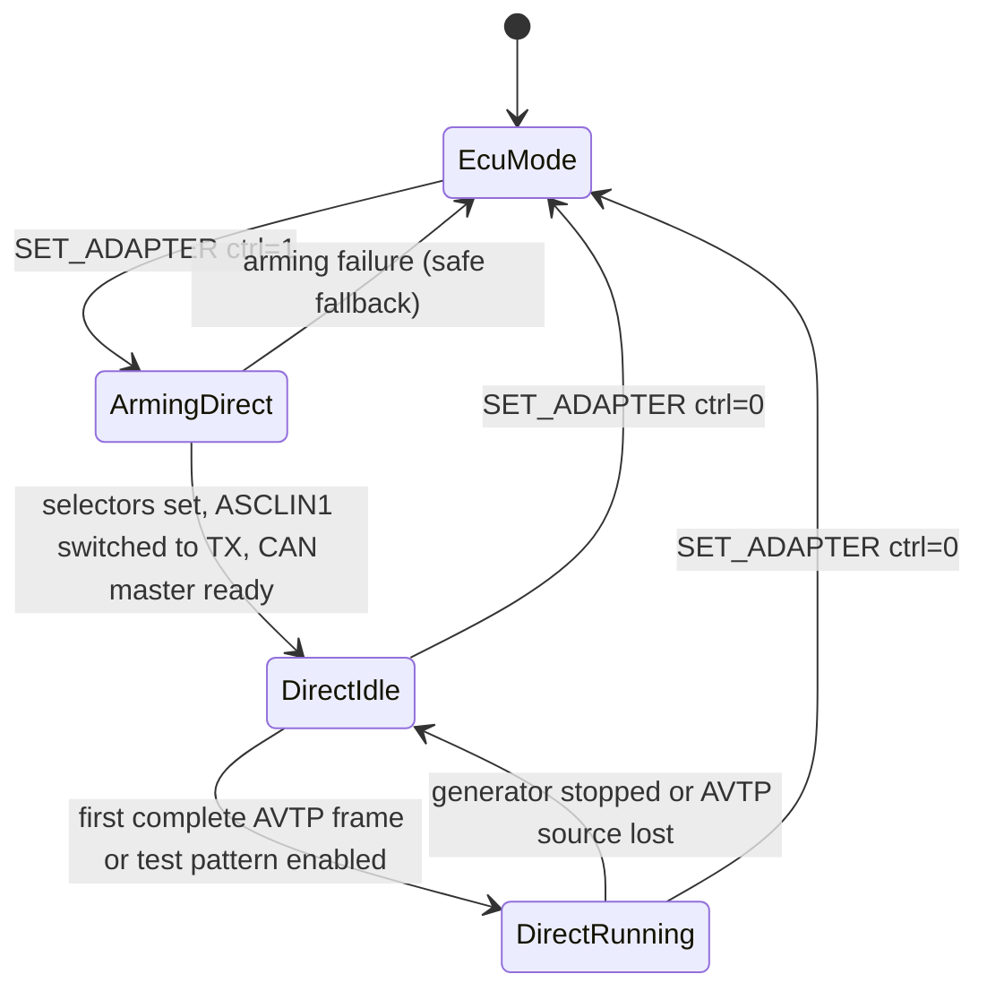

# Direct Control Mode — Architecture and Design Concept

**Status:** Design baseline agreed; Phase 0 measured, Phase 1 implemented and validated on hardware
**Last updated:** 2026-08-27

## 1. Scope

Direct Control Mode removes the vehicle ECU from the test chain. The SmartVisio
Adapter_V2 plus the AURIX TC397 kit become the complete LSM master:

- the AURIX **generates** the LVDS pixel stream and drives it into the LSM through
  `TTL_FROM_LOCAL` (LOCAL_J3 pin 4 / AURIX `P02.2`, ASCLIN1 TX);
- the AURIX **owns** the CAN-UART diagnostic bus towards the LSM
  (`CAN_TX_LSM` / `CAN_RX_LSM`, ASCLIN4) and acts as request master instead of the ECU;
- LED power comes from an external bench supply (~4 V) wired to `EXT_PWR_J4`
  and routed to `LSM_PWR_J6` through the adapter relay (`LED_POWER_SEL` HIGH);
- LSM logic supply comes from the adapter local 5 V (`LOGIC_5V_SEL` HIGH);
- the pixel content is supplied by the PC application as an AVTP/RVF Ethernet stream,
  either forwarded from CANoe (AVTP Monitoring) or generated locally (AVTP Generator).

This document is the technical reference. Implementation progress is tracked in
[Direct_Control_Mode_Implementation_Tracking.md](Direct_Control_Mode_Implementation_Tracking.md).

## 2. Terminology

| Term | Meaning |
| --- | --- |
| ECU Mode | Existing behaviour: ECU drives LVDS + CAN-UART, AURIX only monitors/relays. |
| Direct Control Mode | New behaviour: no ECU, AURIX drives LVDS + CAN-UART. |
| LVDS | Project name for the single-ended UART pixel link. `TTL_FROM_LOCAL` is 0-5 V from the AURIX, converted to 3.3 V on the adapter and only then turned into a differential pair. |
| CAN-UART | Diagnostic UART (2 Mbaud) carried through CAN transceivers used as a differential PHY. |
| AVTP/RVF | IEEE 1722 Raw Video Format stream, ethertype `0x22F0`, 320x80 or 256x64 Gray8 frames. |
| Loopback frame | Frame that the AURIX transmitted on LVDS and mirrors back to the PC on `0x88B5` for pane B. |

## 3. System context

### 3.1 ECU Mode (current, unchanged)



### 3.2 Direct Control Mode (new)



Key consequence: in Direct Control Mode the pane B image is no longer captured from
the ECU. It is the **loopback** of the frame the AURIX actually serialised on
`P02.2`, which keeps pane D (comparison) meaningful.

## 4. Hardware configuration

### 4.1 Power

| Rail | ECU Mode | Direct Control Mode |
| --- | --- | --- |
| LSM LED power (`LSM_PWR_J6`) | `ECU_PWR_J2` via relay, `LED_POWER_SEL` LOW | `EXT_PWR_J4` (bench supply ~4 V), `LED_POWER_SEL` HIGH |
| LSM logic 5 V (`LSM_5V_LOGIC`) | `ECU_5V_LOGIC`, `LOGIC_5V_SEL` LOW | Adapter local 5 V, `LOGIC_5V_SEL` HIGH |
| Adapter 5 V (`AURIX_5V_IN`) | AURIX `V_UC` (X103-2) | AURIX `V_UC` (X103-2) |
| `RL_DET` | not wired on the current harness | not wired, see section 4.4 |

The LSM harness currently connects only `LSM_CAN_L`, `LSM_CAN_H`, `LSM_5V_LOGIC`,
`LSM_LVDS_OUT_L` and `LSM_LVDS_OUT_H` on `LSM_MAIN_J5`, plus the LED supply on
`LSM_PWR_J6`. `LSM_RL_DET` and `ECU_RL_DET` are left open.

Bench-supply requirements to confirm on hardware before first power-on:

- output voltage set and verified **before** connecting `EXT_PWR_J4`;
- current limit set to the LSM datasheet maximum (protects the module if a
  generated frame drives all LEDs at full duty);
- common ground between bench supply, adapter and AURIX kit;
- `ECU_MAIN_J1` fully disconnected (no ECU harness attached).

### 4.2 Adapter selector states

`adapter_ctrl_set_mode(ADAPTER_MODE_DIRECT)` already implements exactly this state
set; Direct Control Mode reuses it without changing the semantics.

| Selector | AURIX pin | ECU Mode | Direct Control Mode |
| --- | --- | --- | --- |
| `TTL_SEL` | P20.0 | LOW (ECU source) | HIGH (local source = `P02.2`) |
| `TTL_FROM_LOCAL` | P02.2 | GPIO held HIGH (UART idle) | ASCLIN1 TX alt2 output |
| `LOGIC_5V_SEL` | P21.3 | LOW | HIGH |
| `LOCAL_RL_DET` | P14.7 | LOW | LOW, signal not wired to the LSM |
| `RL_DET_SEL` | P21.2 | LOW | HIGH (no effect while unwired) |
| `LED_POWER_SEL` | P21.4 | LOW | HIGH |
| `CAN_SEL` | P14.6 | LOW or HIGH (relay) | HIGH (AURIX transceivers active) |

### 4.3 Pin usage summary for the new path

| Function | AURIX pin | X103 | LOCAL_J3 | Status |
| --- | --- | --- | --- | --- |
| LVDS TX to LSM | P02.2 (`IfxAsclin1_TX_P02_2_OUT`, alt2) | 15 | 4 | Configured in Direct Control Mode; ASCLIN1 TX via DMA channel 2 |
| LVDS RX from ECU | P14.8 (ASCLIN1 RXD) | 7 | 3 | Configured (RX-only, DMA channel 1) |
| CAN-UART to LSM | P00.9 TX / P00.12 RX (ASCLIN4) | 31 / 34 | 8 / 10 | Configured (bridge LSM side) |
| CAN-UART to ECU | P00.7 TX / P00.6 RX (ASCLIN5) | 29 / 28 | 13 / 11 | Configured, **idle** in Direct Control Mode |

### 4.4 RL_DET status

`RL_DET` is **not part of Direct Control Mode**. On the current setup the signal is
not wired: `ECU_MAIN_J1` pin 5 is open on the ECU side and `LSM_MAIN_J5` pin 13 is open
on the LSM side. The LSM operates normally without it.

Measured on the LSM with the pin left floating: approximately 1.8 V against LSM ground.
The LSM-side circuit is a 1 kOhm pull-up to its local 3.3 V followed by a 5.11 kOhm
series resistor and a 100 nF filter into the ASIC address input, so the floating pin sits
at its idle bias. This is an observation only; no conclusion about the intended logic
level is drawn from it.

Consequences for the firmware:

- `LOCAL_RL_DET` (P14.7) stays LOW, which is the current default and the fail-safe state;
- `RL_DET_SEL` (P21.2) keeps its Direct Control Mode value but has no electrical effect
  while the signal is unwired;
- if the harness is completed later, the level must be measured on a working ECU setup
  and reproduced, and this section must be updated before relying on it.

### 4.5 LVDS output chain

The local pixel path from the AURIX to the LSM is:

```text
AURIX P02.2 (ASCLIN1 TX, X103-15)   0 .. 5 V
  -> LOCAL_J3-4 TTL_FROM_LOCAL
  -> U8 74LVC1G17 Schmitt buffer, supplied from 3v3_LOCAL
  -> TTL_FROM_LOCAL_3V3             0 .. 3.3 V
  -> U5A 74LVC1G3157 TTL selector, TTL_SEL on pin 6 with a 10 kOhm pull-down
  -> TTL_TO_LSM
  -> U6 NBA3N011S LVDS driver
  -> LSM_LVDS_OUT_H / LSM_LVDS_OUT_L
```

Measured and derived facts:

- `P02.2` idles at a stable 5 V. The AURIX kit uses the 5 V TC397 variant, so the port
  drives 5 V logic levels and the adapter's 74LVC1G17 performs the 5 V to 3.3 V
  conversion. `TTL_FROM_LOCAL` is therefore a 0-5 V signal, not 3.3 V as stated in
  earlier project notes.
- `TTL_SEL` has a 10 kOhm pull-down, so the selector defaults to the ECU input
  (`TTL_FROM_ECU_3V3`) whenever the AURIX does not drive the line. This matches the
  fail-safe rule and the `adapter_ctrl` polarity.
- The ECU-side branch is symmetric: `ECU_LVDS_IN_H/L` -> U2 NBA3N012C receiver ->
  `TTL_FROM_ECU_3V3` -> selector, and it is also the signal ASCLIN1 receives on P14.8.
- The selector path is validated indirectly by the existing LVDS fault injection:
  forcing the local idle source is visible to the ECU as a communication fault, which
  proves that `TTL_SEL` HIGH really routes `TTL_FROM_LOCAL` to the LSM driver.

## 5. AURIX resource allocation

### 5.1 ASCLIN1 direction problem

ASCLIN1 is today configured RX-only (`asclin1_dma.c`, pin `IfxAsclin1_RXD_P14_8_IN`).
In Direct Control Mode the ECU is absent, so `TTL_FROM_ECU_3V3` carries no traffic and
the RX path has no purpose. The design is fixed as **one direction at a time**:

- **ECU Mode**: ASCLIN1 configured RX-only, `P02.2` stays a GPIO driven HIGH by
  `adapter_ctrl` (current behaviour, unchanged).
- **Direct Control Mode**: ASCLIN1 reconfigured **TX-only** on `P02.2`; the RX DMA
  channel is stopped and the RX pin is released.

Rationale for not running RX and TX simultaneously:

- it avoids an ASCLIN reconfiguration race between the LVDS RX DMA ISR and the TX DMA ISR;
- the RX stream is meaningless without an ECU;
- a single reconfiguration point (`lvds_tx_enable()` / `lvds_tx_disable()`) keeps
  the failure modes analysable.

Reconfiguration must follow the proven safe sequence used for ASCLIN9 (see repo memory
on the RFO/DAE lesson): stop the DMA channel first, disable the SRC, flush the FIFO,
clear the flags, then reconfigure. `IfxAsclin_resetModule()` must not be used while
a DMA channel is armed on that ASCLIN.

### 5.2 Pin handover for P02.2

`adapter_ctrl_init()` currently drives `P02.2` as a push-pull GPIO HIGH. The handover
rules are:

1. Enter Direct Control Mode: select `TTL_SEL` HIGH **while `P02.2` is still GPIO HIGH**,
   then switch `P02.2` to ASCLIN1 TX (alt2). The line never glitches LOW, so the LSM
   never sees a spurious start bit.
1. Leave Direct Control Mode: stop the TX DMA, wait for the ASCLIN TX FIFO to drain,
   switch `P02.2` back to GPIO HIGH, then set `TTL_SEL` LOW.
1. `lvds_fault_inject.c` (`SELECT_LOCAL_IDLE`) relies on `P02.2` idling HIGH. In Direct
   Control Mode the equivalent fault is "stop the local generator", so the module needs a
   Direct-Mode-aware branch instead of only toggling `TTL_SEL`.

### 5.3 DMA, ISR and core allocation

| Resource | Current owner | Direct Control Mode |
| --- | --- | --- |
| DMA channel 0 | legacy diagnostic | unchanged |
| DMA channel 1 | ASCLIN1 RX (LVDS from ECU) | stopped while Direct Control Mode is active |
| DMA channel 2 | free | **new**: ASCLIN1 TX (LVDS to LSM) |
| DMA channel 5 | `dma_sanity.c` | unchanged |
| ISR prio 10 | GETH TX | unchanged |
| ISR prio 11 / 12 | CAN-UART bridge ECU / LSM RX | unchanged |
| ISR prio 13 | diagnostic | unchanged |
| ISR prio 14 | ASCLIN1 RX DMA | unchanged |
| ISR prio 15 | free | Nichia row timer; TX completion remains polled |
| ISR prio 20 | camera trigger | unchanged |
| CPU0 | ASCLIN1, DMA, GETH, parsers | plus AVTP ingest + LVDS TX scheduling |
| CPU1 | TFT UI | plus Direct Control Mode status display |
| CPU2 | CAN-UART bridge | plus CAN-UART master scheduler (Direct Control Mode only) |
| CPU3 | idle, hosts LVDS RX DMA buffers (dsram3) | unchanged |
| CPU4 | idle | hosts LVDS TX DMA buffers (dsram4) |

Buffer placement follows the SRI-contention lesson: the LVDS TX DMA source buffers must
live in a DSPR bank that no other master hammers. `dsram4` (CPU4 idle, 96 KB) is used via
`__attribute__((section(".bss.bss_cpu4")))`, keeping `dsram3` reserved for the RX path.

### 5.4 Transmit DMA feeding scheme

The ASCLIN TX FIFO is 16 entries deep with a one-byte inlet. The transmit interrupt level
is set to 8, so the FIFO raises a request once eight entries are free, and the DMA answers
each request with an eight-move block. Both stream sizes divide by eight
(25608 / 8 = 3201 transfers, 16640 / 8 = 2080 transfers), so a single DMA transaction
covers exactly one frame and the transfer count never needs reprogramming.

Two behaviours are worth recording, because they are easy to get wrong:

- the FIFO fill-level flag is already asserted on an empty FIFO, so enabling the channel
  alone never produces a rising edge and the transfer would never start. One software
  service request is raised at frame start to prime the chain; every later refill is
  triggered by the FIFO itself;
- completion is **polled** from the CPU0 main loop (DMA transfer count at zero and TX FIFO
  empty) instead of using a completion ISR. The main loop iterates far faster than the
  13-14 ms needed to serialise a frame, and this keeps one ISR priority free. If the
  camera trigger later needs tighter frame-complete timing, priority 15 is reserved for a
  transmit ISR.

A stall guard aborts a transaction that outlives four transmit periods, flushes the FIFO
and lets the next period start a fresh frame. It is counted in `stallRearms`.

### 5.6 Why the pixel path stays on CPU0

Moving the Direct Control Mode pixel path to an idle core was considered, because CPU3,
CPU4 and CPU5 run empty idle loops. It is not done, for two reasons.

The measured bottleneck is not CPU time. Switching the pane B mirror between off and
every-frame changed the accepted-chunk rate from 18.45 to 18.44 per 20-chunk frame, and
removing two thirds of the per-frame bulk work changed nothing measurable. The loss was
located inside the MAC receive FIFO, upstream of both the DMA and the CPU. No amount of
core reallocation moves that.

Ownership would also have to be split in an awkward place. GETH, its descriptor rings and
the frame reassembler are driven from `frame_eth_poll_rx()` on CPU0, and the LVDS
transmitter reconfigures ASCLIN1 and DMA channel 2, which CPU0 also owns through
`device_mode`. Handing the pixel path to another core would require a cross-core ring for
the frames plus careful ownership rules for the peripherals, for no measured benefit.

The pattern that does work in this project is moving *memory* rather than *code*: the LVDS
transmit buffers sit in `dsram4` and the AVTP frame buffers in `dsram5`, so the DMA engines
get uncontended scratch-pad banks. That is already applied. If a future stage does become
CPU-bound, the natural split is to give an idle core the frame build (copy plus CRC) with a
handover ring, keeping all peripheral access on CPU0.

Measured on hardware: the serialisation time is 14084.9 us, matching the theoretical
14.08 ms exactly, with zero inter-byte gaps across a full frame. In steady state the
polled completion tracks the real end of the transfer closely (`lastFrameUs` reads
14085-14089 us), so the main loop keeps up comfortably. A larger value indicates the loop
spent longer elsewhere in that period; it is harmless for pacing but is the deciding
factor if the camera trigger later needs a real completion ISR.

### 5.5 Built-in test patterns

Two static patterns are available while no AVTP source feeds the generator:

| Value | Name | Content |
| --- | --- | --- |
| 0 | `LVDS_TEST_PATTERN_BLACK` | every pixel 0 |
| 1 | `LVDS_TEST_PATTERN_GRID4` | value 120 on every 4th pixel of every 4th row, starting at pixel 0 of row 0 |

The grid pattern lights 80 x 20 pixels on an OSRAM frame and 64 x 16 on a NICHIA frame.
Value 120 is roughly 47 % of the 255 maximum, which keeps the module well below full load
while still being clearly visible.

Selection is made through `g_lvdsTxTestPattern`, a volatile byte written from the
debugger watch window, and `g_lvdsTxForceTestPattern` forces the pattern even when the
AVTP stream is the configured source. Both are picked up on the next transmit period.
Because the patterns are static, the stream is rebuilt only when the selection changes;
re-sending an unchanged pattern is the intended content for that period and is therefore
not counted as a starvation repeat. A PC-side selection is added together with
`FE_CMD_DIRECT_LVDS_CFG`.

## 6. Data path 1 — AVTP ingress to LVDS transmission

### 6.1 Pipeline

```text
PC / CANoe AVTP 0x22F0 (20 packets x 1280 px bytes)
  -> GETH RX (frame_eth_poll_rx)
  -> avtp_rx.c   : VLAN skip, RVF header decode, line reassembly
  -> 320x80 Gray8 frame buffer (double buffered)
  -> lvds_frame_build.c : device-specific byte stream (header + pixels + CRC)
  -> lvds_tx.c   : ASCLIN1 TX + DMA channel 2 on P02.2
  -> Adapter TTL_SEL = HIGH -> LSM
  -> frame_eth loopback ("OS"/"NI" fragments) -> PC pane B
```

### 6.2 AVTP ingress details

The firmware parser must mirror `AvtpRvfParser.cs` exactly:

| Field | Offset | Meaning |
| --- | --- | --- |
| EtherType | Ethernet `[12..13]` | `0x22F0`, after skipping optional `0x8100` / `0x88A8` VLAN tags |
| End-of-frame bit | AVTP payload byte 22, mask `0x10` | last packet of a frame |
| First line number | AVTP payload byte 31 | 1-based, values `1, 5, 9, ... 77` |
| Pixel payload | AVTP payload bytes 32..1311 | 4 lines x 320 bytes = 1280 bytes |

Reassembly rules:

- write payload into the assembly buffer at `(line1 - 1) * 320`;
- track a received-chunk bitmask; a frame is complete when the end-of-frame bit arrives
  **and** all 20 chunks are present;
- an incomplete frame is dropped, counted, and the previous frame is repeated on LVDS
  (the LSM must never see a truncated frame);
- a new chunk 0 before the end-of-frame bit closes the previous frame as incomplete;
- the packet length is taken from the receive descriptor write-back field `RDES3.PL`
  before the buffer is handed over, so a short packet can never be parsed together with
  stale bytes left in the ring buffer;
- the completed frame is published by swapping ping-pong buffer indices, so reassembly of
  the next frame starts immediately and the receive loop never performs a full-frame copy.

Both buffers live in `dsram5` (CPU5 idle). They are only accessed by CPU0, and keeping
them out of `dsram0` and `dsram4` leaves the Ethernet receive DMA and the LVDS transmit
DMA their own uncontended banks.

### 6.3 GETH RX capacity

The PC or CANoe emits one frame as a burst of 20 back-to-back packets of 1330 bytes, at a
fixed 100 fps because that is what the vehicle does. At gigabit line rate a packet occupies
about 10.6 us, so a burst delivers 26.6 KB in roughly 212 us.

Two independent stages must absorb that burst.

**MTL receive FIFO.** The RX queue is configured in store-and-forward mode, so the MAC
holds a complete packet in the FIFO before the DMA starts moving it. The FIFO size is
therefore the real burst buffer. The single RX queue is given the full 8192 bytes, which
holds six 1334-byte packets. At 2560 bytes it held less than two, and packets were dropped
inside the MAC on every burst while the descriptor ring still had free entries. The
symptom is unmistakable: `GETH_RX_FIFO_OVERFLOW_PACKETS` climbing while the DMA status
never sets RBU.

**DMA descriptor ring.** 32 descriptors of 1536 bytes, so one slot short of the ring holds
a full 20-packet burst with margin. The iLLD default of 8 was not enough: it buffers 7
usable packets, which together with the FIFO covered only about 13 of the 20 packets, so
the tail of a burst was lost whenever CPU0 was busy for more than a few tens of
microseconds. The depth is set through `IFXGETH_MAX_RX_DESCRIPTORS` in
`Configurations/Ifx_Cfg.h`; `IfxGeth.h` guards it with `#ifndef` and includes `Ifx_Cfg.h`
first, so iLLD's own descriptor list is sized from the same value. `FE_RX_DESCRIPTORS`
must match, and a compile-time check in `frame_eth.c` enforces it.

The ring also needs one thing that iLLD does not do:
`IfxGeth_Eth_freeReceiveBuffer()` hands a descriptor back to the DMA and advances the
software pointer, but never moves `RXDESC_TAIL_POINTER`. The EQoS receive DMA stops when
it reaches the tail, and `IfxGeth_Eth_wakeupReceiver()` only restarts it when the
receive-process-stopped flag is set, which an RBU suspend does not set. On a busy ring the
DMA therefore suspends and stays suspended. `frame_eth_poll_rx()` closes this by moving the
tail to the last descriptor it returned, which keeps the whole ring minus one slot
available to the DMA.

**Stall watchdog.** `FE_RX_STALL_MS` is 200 ms. The watchdog only arms when RBU or a FIFO
overflow was latched since the last processed buffer, so it cannot misfire on a genuinely
idle link; the short timeout simply keeps a residual stall down to a couple of frames
instead of the two seconds the original sparse-command value implied.

CPU0 work is a third-order effect here, which was verified rather than assumed: switching
the pane B mirror between off and every-frame changed the accepted-chunk rate by less than
0.1 %, and removing two thirds of the per-frame bulk work changed nothing either. The
receive path is nevertheless kept lean, because the buffering only buys time:

- reassembly writes each 1280-byte chunk straight into a ping-pong frame buffer, and
  completing a frame only swaps the buffer indices; there is no full-frame copy inside
  the receive loop;
- the stream build (one copy plus one CRC pass) runs only when the transmitter actually
  needs the next frame, so it happens at the transmit rate and not at the arrival rate;
- the pane B mirror is paced separately, see section 6.8.

The longest remaining CPU0 block is the table-driven CRC-32 over 25600 bytes in the stream
build, roughly 0.8 ms every 20 ms. With 32 descriptors the burst is absorbed regardless, but
if a future stage needs more headroom the lever is the TriCore `__crc32lw` hardware
instruction, which is what the ECU itself uses (see the note in `osram_crc32.h`). Any such
change must reproduce the documented self-test vectors exactly.

A source running faster than the transmit period is normal: the newest completed frame
replaces the previous one inside the reassembler at no cost, counted by
`framesDroppedBusy`. `framesIncomplete` counts real packet loss and is the metric to
watch.

MAC filtering: see section 6.4.

### 6.4 MAC acceptance policy for the AVTP stream

`frame_eth_init()` programs only the station address `02:0A:F0:4E:49:01`
(`config.mac.macAddress`) and leaves `MAC_PACKET_FILTER` at its reset value, so the MAC
currently accepts its own unicast address plus broadcast. The AVTP stream uses the
multicast destination `01:00:5E:16:00:12`, which would be filtered out.

The firmware therefore enables **pass-all-multicast** in `MAC_PACKET_FILTER` when Direct
Control Mode is armed, and the PC keeps sending the stream unchanged. The addressing was
confirmed on the wire: source MAC `3C:CE:15:00:00:19`, destination MAC
`01:00:5E:16:00:12`, VLAN 70. Reasons:

- in AVTP Monitoring the frames originate from CANoe with a fixed destination MAC; the
  PC must be able to forward them without rewriting the Ethernet header;
- the same firmware path then works for a CANoe stream, a PC-generated stream and a PCAP
  replay, with no per-source configuration;
- unicast to `02:0A:F0:4E:49:01` and broadcast keep working, so a PC-side stream sent to
  either destination is also accepted; this stays a valid fallback if pass-all-multicast
  proves too permissive on a shared network.

Extra RX load is bounded by the early ethertype check in `frame_eth_poll_rx()` (anything
that is neither `0x88B5` nor `0x22F0` is freed immediately), and by the recommendation to
keep the AURIX on a dedicated link or an isolated switch/VLAN. Promiscuous mode is
explicitly **not** used, because it would also admit unicast traffic of other stations.
The filter is restored to its reset value when Direct Control Mode is left.

### 6.5 OSRAM LVDS frame encoding

Byte stream produced per frame (`osram_frame.h` is the authoritative reference):

```text
[0..3]         0x80 0xA5 0xAA 0x55
[4..25603]     25600 pixel bytes (320x80, Gray8, row-major)
[25604..25607] CRC-32, seed 0xDEADAFFE, MSB-first, bswap32 on output
```

- UART framing: 20 Mbaud, **8O2** (odd parity, two stop bits), LSB first.  The ECU
  drives the pixel line with 12-bit characters; a Saleae capture of the ECU shows a
  600 ns byte period, 50 ns more than 8O1 would give.  Transmitting 8O1 makes the LSM
  report `Wrong Stop Bit` and discard every frame;
- the CRC must be computed with the existing `osram_crc32.c` implementation, so the
  transmitted stream is bit-identical to what the ECU would send;
- serialisation time: 25608 bytes x 12 bits / 20 Mbaud = **15.37 ms**, i.e. a hard
  ceiling of ~65 fps; at the nominal 50 fps the line is busy ~77 % of the time.

### 6.6 NICHIA LVDS frame encoding

```text
per row (64 rows), 260 bytes:
[0]         0x5D
[1]         row index (0..63) with parity bits 7:6
[2..257]    256 pixel bytes
[258..259]  CRC-16 over the 256 pixel bytes, MSB first
```

- UART framing: 12.5 Mbaud, 8N1;
- CRC from `rx_crc.c` (`ioHwAbsTLD816K_Crc16`);
- serialisation time: 16640 bytes x 10 bits / 12.5 Mbaud = **13.31 ms** (~75 fps ceiling).

Source-to-device geometry rule (applies to both devices):

- if the AVTP source geometry equals the device geometry, pixels are mapped 1:1 and no
  conversion is performed; this is the normal case for a Nichia-recorded AVTP stream;
- if a 320x80 source drives a Nichia device, the default is a **centre crop** to 256x64
  (x offset 32, y offset 8), because it preserves exact pixel values and keeps the pane D
  comparison free of resampling artefacts;
- block-average downscale stays available as a selectable option for content that must be
  seen in full;
- the applied rule is reported in the Direct Control Mode status record so the PC can
  label pane B correctly.

### 6.7 Pacing and buffer ownership

- The LVDS transmitter runs on a fixed period, independent of the AVTP arrival jitter.
  A free-running transmitter is required because the LSM expects a continuous stream.
- The period is a firmware constant of 20 ms (50 fps) for the first implementation, and is
  made configurable from the PC through `FE_CMD_DIRECT_LVDS_CFG` once the path is stable.
  The firmware clamps any requested value to the physical ceiling of the active device
  (~71 fps OSRAM, ~75 fps NICHIA).
- If no new complete AVTP frame is available at the period boundary, the previous frame
  is retransmitted and a `repeatedFrames` counter increments.
- If the AVTP source stays silent for longer than the starvation timeout (default 200 ms),
  the transmitter switches to an all-zero frame and keeps streaming it. The stream is never
  stopped, so the LSM keeps its link alive, and the LEDs are not left frozen on the last
  bright image when the PC or CANoe stops.
- Triple state: `assemblyBuf` (written by AVTP ingest), `readyBuf` (complete frame waiting),
  `txBuf` (being serialised by DMA). Buffers are swapped only between DMA transfers, never
  during one.
- The camera trigger follows the **transmitted** frame in Direct Control Mode: there is no
  ECU frame on ASCLIN1 to synchronise to, so `direct_mode` fires a single-shot trigger on
  each `lvds_tx_take_frame_complete()`.

### 6.8 Loopback for pane B

When a completed AVTP frame is accepted by the generator, the same pixel buffer is pushed
to `frame_eth_push_osram_frame()`. The PC then receives the usual `OS` fragments and pane
B, pane D, recording, defect and flicker features keep working unchanged. Only frames that
the generator actually accepted are mirrored, so pane B reflects what was transmitted
rather than what was received from the network.

The mirror is **paced independently of the transmit rate**. Each mirrored frame costs 18
Ethernet fragments of transmit work on the same core that must drain the receive ring, so
running it at the full transmit rate competes directly with the AVTP ingress. Pane B is a
monitoring view, so the default is one mirror every `DM_LOOPBACK_INTERVAL_US` (50 ms,
20 fps).

An OSRAM frame is larger than the intermediate transmit buffer, so `frame_eth` fragments
it straight out of the assembly buffer across several main-loop passes. A push that lands
while that buffer is still being fragmented would put a torn frame on the wire, so such a
push is skipped and counted in `pushSkippedTxBusy`. The counter is also the direct evidence
for whether the mirror rate exceeds what the transmit path can drain.

`g_directLoopbackMode` selects the policy from the debugger:

| Value | Behaviour |
| --- | --- |
| 0 | mirror off, minimum Ethernet transmit load |
| 1 | paced mirror at `DM_LOOPBACK_INTERVAL_US` (default) |
| 2 | mirror every transmitted frame |

Setting it to 0 is also the fastest way to measure how much of the receive loss the
mirror is responsible for: `g_avtpRxStats.framesIncomplete` is compared with the mirror
on and off, with nothing else changed.

The NICHIA loopback uses the row-based push: 64 rows are assembled into one 256x64
frame and emitted with the `NI` fragment magic. The common Ethernet TX path also
selects the Nichia geometry and fragment count when device mode is Nichia.

## 7. Data path 2 — CAN-UART master

### 7.1 Role change

| Aspect | ECU Mode | Direct Control Mode |
| --- | --- | --- |
| Bus master | ECU | AURIX (ASCLIN4, LSM side) |
| ASCLIN5 (ECU side) | active relay | idle, TX held HIGH |
| `CAN_SEL` | LOW or HIGH | HIGH |
| Monitoring records | relayed traffic | locally generated request + LSM response |
| Defect injection | in-flight filter on relayed responses | applied on the response the AURIX received |

### 7.2 Master responsibilities

1. Reproduce the ECU start-up register sequence so the LSM leaves its safe state and
   accepts pixel data. Reference material already in the repository:
   `docs/LSM_CAN_Docs/trace_Osram205_StartUp_Run_*.txt`,
   `docs/LSM_CAN_Docs/trace_Nichia_StartUp_Run_*.txt`, `UART_Protocol.csv`, EEPROM maps.
1. Run the cyclic diagnostic requests (status/error registers) at the same cadence the
   ECU used, so watchdog-like LSM behaviour is satisfied.
1. Publish every transaction on the existing `CD` (`0x4344`) Ethernet record path, so the
  CAN/UART monitor UI works identically in ECU Mode and Direct Control Mode. In Direct
  Control Mode the record is generated locally from the master request and the LSM
  response; the ECU-side relay is not required.
1. Keep the defect-injection filters usable by feeding them the LSM response bytes.

### 7.3 Frame construction

OSRAM (KEWGBXXD1U) request format is already documented in repo memory:

```text
[0] 0x80
[1] 0xA5
[2] HCTRL : bit7 RW, bits6:5 ID, bits4:1 LEN(nRegs-1), bit0 ADR[8]
[3] HADR  : ADR[7:0]
[4..]     : register data pairs, MSB:LSB (write only)
[end-2..] : CRC-16, seed 0xDEAD, over bytes [2..end-2], MSB first
```

Read requests are 4 bytes; write commands carry data plus CRC-16. The LSM response to
an `nRegs` read contains `nRegs * 2 + 2` bytes: the register data followed by CRC-16;
it does not repeat the four-byte request header.

### 7.4 Sequence source

The sequence is taken from a captured ECU trace rather than reconstructed from register
documentation, because the LSM stays in failsafe until it has seen the exact conversation
it expects. `scripts/analyze_can_uart_trace.py` parses a trace, splits it into the two
phases and generates `Aurix_Firmware/can_uart_osram_sequence.h`.

Measured structure of `trace_Osram205_StartUp_Run_20260818_181416.txt` (7693 transactions
over 9.6 s):

| Phase | Transactions | Content |
| --- | --- | --- |
| Start-up | 1290 | 338 writes to 27 registers, 952 reads |
| Cyclic run | 32 per super-cycle, about 33.7 ms | keep-alive plus status polling |

The start-up phase begins with eight writes of `0x0001 = 0x0001` about 10 ms apart, which
is the ECU waiting for the LSM to answer, then configures the device and loads 109 NVM
blocks. Each NVM block is the triple `W 0x0008` (two-register address pointer),
`W 0x0007 = 0x0100` (trigger) and a read of `0x0100`.

The cyclic phase is four groups of eight transactions. Every group starts with
`W 0x0006 = 0x3100`, which is the keep-alive the LSM expects, followed by status reads;
the groups rotate through the error register blocks `0x0070/0x00B0`, `0x0080/0x00C0`,
`0x0090/0x00D0` and `0x00A0/0x00E0`.

Request lengths on the wire are 4 bytes for a read (header only, no CRC), 8 bytes for a
single-register write and 10 bytes for a two-register write. The generated table stores
the request bytes verbatim together with the idle gap observed before them, so the AURIX
reproduces the ECU byte for byte instead of re-deriving CRCs and timing.

PC-driven replay of a `.rply` trace remains available and overrides the built-in table
while it runs. On entry to Direct Control, the AURIX master now waits idle instead of
starting the built-in startup table. The C# Replay command uploads one request per
Ethernet `CM` command (`0x08`), followed by a commit command (`0x09`). A valid commit
starts the uploaded startup sequence; after it completes, the existing 32-step cycle
is used. This keeps the built-in table available for a future standalone AURIX/TFT
Direct Control workflow without using it during the PC replay test.

The PC-side loader rejects a trace unless it contains the OSRAM startup signature:
the initial `W 0x0001 = 0x0001` polling prefix, the initial `W 0x0000 = 0x60F5`
configuration write and the first `0xBE` status read. It also requires the complete
startup boundary (1291 valid OSRAM transactions for the current OSRAM 2.0 trace).
NormalRun-only traces, such as Fix6, are therefore rejected before any Ethernet
sequence command is sent.

Half-duplex arbitration must be preserved: the master transmits a request, then waits for
the response window before sending the next request. Response timeout, retry count and
"no response" telemetry are mandatory.

### 7.5 Integration with the existing bridge

ASCLIN4 (LSM side) and ASCLIN5 (ECU side) are owned by `can_uart_bridge.c`, whose RX
interrupts run on CPU2 and forward bytes between the two channels with echo-based
half-duplex arbitration. In Direct Control Mode there is no ECU, so:

- forwarding is disabled (`can_uart_bridge_set_active(FALSE)`), leaving ASCLIN5 idle with
  its TX line high;
- the master transmits on ASCLIN4 through the same `IfxAsclin_writeTxData()` path the
  bridge uses, and consumes the LSM responses from the ASCLIN4 RX FIFO;
- the master runs on CPU2, the core that already owns those interrupts, so no peripheral
  ownership is split across cores;
- every transaction is published on the existing `CD` record path, so the CAN/UART monitor
  UI works unchanged.

The byte source has to be shared with the bridge's relay pump rather than duplicated: the
pump is the single reader of the ASCLIN4 RX FIFO and already handles overflow resync. When
`s_bridgeActive` is zero the pump still drains the FIFO, so it hands each LSM byte to
`can_uart_master_feed_rx()`.

Two timing properties drive the state machine:

- whether a transmitted byte comes back as a transceiver echo is **not assumed**. The master
  captures the raw byte stream for each step and decides per transaction by comparing the
  head of the capture with the request it just sent. Hardware measurements showed the echo
  is absent in Direct Control Mode, while the bridge relies on it in ECU mode, so counting
  a fixed number of echo bytes consumed the start of the real answer and made every
  response unusable. `echoSeenCount` and `echoAbsentCount` make the actual behaviour
  visible;
- the LSM turnaround is only a few microseconds, faster than the tick that would move the
  state machine into its response window, so bytes are captured from the moment the request
  is queued.

The end of a response is found by **counting bytes, not by waiting for bus idle**. The
length follows from the request header: HCTRL bits 4:1 hold `nRegs - 1`, so the answer is
`nRegs * 2 + 2` bytes. The formula was checked against all 6554 read responses in the
captured trace with no mismatch. Idle detection remains only as the fallback for a
truncated answer, because using it as the primary rule cut long answers short and shifted
every following step.

The master captures the raw RX bytes from the moment the request is queued. At each tick,
the raw length and the first-response timestamp are sampled atomically against the RX
handler. This prevents a response from being closed using an intermediate length while
the final byte is arriving. A response that starts but is incomplete remains open until
the protocol length arrives or the absolute response timeout expires; an empty response
is classified as a timeout. Completed transactions are copied into the CPU2-to-CPU0
output ring and published as `CD` records by the existing diagnostic Ethernet path.

Both rules matter for more than data quality: a step that waits needlessly delays the
`W 0x0006 = 0x3100` keep-alive that the LSM expects roughly every 8.4 ms, and the device
falls back to failsafe when that cadence slips.

`can_uart_bridge_set_active(FALSE)` only stops forwarding; `CAN_SEL` stays HIGH from
`adapter_ctrl_apply()`, so the bus remains routed through the AURIX transceivers while the
master drives it.

## 8. Ethernet control protocol extensions

Existing commands (`0x88B5`, magic `CM`) are extended, keeping backward compatibility.
`FE_CMD_SET_ADAPTER` (0x03) already carries the control mode byte and is reused to enter
and leave Direct Control Mode.

| Command | ID | Direction | Purpose |
| --- | --- | --- | --- |
| `FE_CMD_SET_ADAPTER` | 0x03 | PC to AURIX | Existing; `ctrlMode = 1` now also arms the LVDS generator and CAN-UART master. |
| `FE_CMD_OSRAM_SEQ_STEP` | 0x08 | PC to AURIX | Stage one OSRAM CAN-UART Direct Control request. |
| `FE_CMD_OSRAM_SEQ_COMMIT` | 0x09 | PC to AURIX | Commit the staged OSRAM startup sequence. |
| `FE_CMD_NICHIA_SEQ_STEP` | 0x0A | PC to AURIX | Stage one Nichia CAN-UART Direct Control request. |
| `FE_CMD_NICHIA_SEQ_COMMIT` | 0x0B | PC to AURIX | Commit the staged Nichia startup sequence. |
| `FE_CMD_NICHIA_SEQ_HARDCODED` | 0x0C | PC to AURIX | Start the built-in Nichia startup table. |
| `DS` status record | `0x4453` | AURIX to PC | Direct Control Mode telemetry: AVTP frames received/dropped, LVDS frames sent/repeated, TX underruns, CAN master transactions/timeouts. |

The command IDs `0x08`..`0x0C` are allocated to trace-driven and built-in startup
control. Existing record magics are `NI`, `OS`, `CM` and `CD`, so `DS` (`0x4453`) does
not collide. The numbering is fixed and must be kept identical in `frame_eth.h` and
in the C# senders.

## 9. Firmware module map

| File | Type | Responsibility |
| --- | --- | --- |
| `lvds_tx.c/.h` | added | ASCLIN1 TX configuration on `P02.2`, DMA channel 2, transmit pacing, stall guard, telemetry. |
| `lvds_frame_build.c/.h` | added | Convert a Gray8 frame into the OSRAM or NICHIA byte stream (header, CRC, row framing) and render the built-in test patterns. |
| `avtp_rx.c/.h` | added | AVTP/RVF parsing and frame reassembly from GETH RX buffers, buffers in `dsram5`. |
| `direct_mode.c/.h` | added | Direct Control Mode pixel path: AVTP frame to generator hand-off, pane B loopback policy, camera trigger source and telemetry. |
| `can_uart_master.c/.h` | added | Replays OSRAM or Nichia diagnostic sequences on ASCLIN4 from CPU2, with device-specific request/response lengths, timing, echo handling and locally generated `CD` records. |
| `adapter_ctrl.c/.h` | changed | `adapter_ctrl_ttl_local_take_gpio()` re-claims `P02.2` as a GPIO driven HIGH when the transmitter releases it. |
| `asclin1_dma.c/.h` | changed | `asclin1_dma_stop()` disarms the receive DMA and service request before the direction switch. |
| `device_mode.c/.h` | changed | A device switch while the transmitter is active reconfigures baud/framing, parser state, Ethernet geometry and the transmitter instead of re-arming the receive DMA. |
| `frame_eth.c` | changed | `SET_ADAPTER` arms the transmitter on entry and releases it before the selector returns to the ECU source. |
| `Cpu0_Main.c` | changed | `lvds_tx_init()` at startup, `lvds_tx_tick()` in the loop, receive watchdog suppressed while transmitting. |
| `frame_eth.c/.h` | changed | AVTP ethertype dispatch, receive length from `RDES3.PL`, 8 KB MTL RX FIFO, `frame_eth_set_pass_all_multicast()`, generator arming from `SET_ADAPTER`. |
| `lvds_fault_inject.c/.h` | change | Direct-Mode-aware fault semantics (stop generator instead of switching selector). |
| `camera_trigger.c/.h` | unchanged | Driven from `direct_mode` through the existing single-shot API. |
| `Cpu2_Main.c` | change | Host the CAN-UART master scheduler tick. |
| `tft_ui.c/.h` | change | Show Direct Control Mode state, generator status and centred Nichia 256x64 content. |

### 9.1 Transmitter activation in the current build

Until the dedicated `FE_CMD_DIRECT_LVDS_CFG` command and its PC-side sender exist, the
transmitter is armed by the command the UI already sends:

- `SET_ADAPTER_MODE` with control mode Direct arms `lvds_tx` for the active device,
  enables pass-all-multicast and selects the AVTP stream as source. Until the first
  complete AVTP frame arrives the transmitter streams black, so the link is alive from
  the first period;
- the built-in test patterns remain reachable by writing `LVDS_TX_SOURCE_TEST_PATTERN`
  to the source, with `g_lvdsTxTestPattern` choosing between black and the grid;
- `SET_ADAPTER_MODE` with control mode ECU stops the transmitter, drains the TX FIFO,
  restores the MAC filter and returns `P02.2` to the GPIO idle level before the selector
  switches back.

The source becomes the AVTP stream in Phase 2, with the test pattern kept as a bring-up
and starvation fallback.

## 10. PC application (VilsSharpX) changes

| Area | Change |
| --- | --- |
| `MainWindow.xaml.cs` mode constraints | Direct control already forces LVDS Mode = Generator and CAN mode = SmartVisio LSM; extend it to start/stop the AVTP-to-AURIX transmission. |
| AVTP routing | In Direct Control Mode the AVTP stream must be emitted on the NIC connected to the AURIX. In AVTP Monitoring the PC forwards the CANoe frames; in AVTP Generator it sends its own. The destination MAC is left unchanged, per section 6.4. |
| `AvtpRvfTransmitter.cs` | Reuse as-is; the 100 fps limiter already protects the link. A configurable target fps aligned with the firmware generator period is preferable. |
| New `DirectModeCommand.cs` | Sender for the new `0x88B5` commands (generator config, CAN sequence, status request). |
| New status consumer | Parse the `DS` telemetry record and surface it in the diagnostics panel/log. |
| Pane B labelling | Mark the frame source as loopback when Direct Control Mode is active. |
| CAN replay | Implement `BtnCanReplay_Click` on top of `FE_CMD_DIRECT_CAN_SEQ`. |
| Safety interlocks | Block entering Direct Control Mode while an LVDS/CAN fault injection is active, and warn if no AVTP source is running. |

## 11. Mode transition state machine



Entry order (must not be reordered):

1. Stop the LVDS RX DMA and parsers.
1. Set `LOGIC_5V_SEL`, `LED_POWER_SEL`, `RL_DET_SEL`, `LOCAL_RL_DET` for local supply.
1. Set `CAN_SEL` HIGH and initialise the CAN-UART master with TX idling HIGH.
1. With `P02.2` still GPIO HIGH, set `TTL_SEL` HIGH.
1. Switch `P02.2` to ASCLIN1 TX and start the generator in "idle line" state.
1. Run the LSM start-up register sequence.
1. Enable the frame transmitter.

Exit order is the exact reverse, ending with `adapter_ctrl_set_mode(ADAPTER_MODE_ECU)`.

## 12. Timing and resource budget

| Item | Value | Note |
| --- | --- | --- |
| OSRAM frame serialisation | 14.08 ms | 25608 B x 11 bits at 20 Mbaud |
| OSRAM maximum frame rate | ~71 fps | hard physical ceiling |
| NICHIA frame serialisation | 13.31 ms | 16640 B x 10 bits at 12.5 Mbaud |
| NICHIA maximum frame rate | ~75 fps | hard physical ceiling |
| Target generator rate | 50 fps (20 ms) | matches current ECU-driven observation |
| AVTP ingress | 2000 packets/s, ~21 Mbit/s | 20 packets per frame at 100 fps |
| AVTP burst | 26.6 KB in ~212 us | absorbed by the 8 KB MTL RX FIFO plus 32 descriptors |
| LVDS TX DMA buffers | 2 x 25608 B | `dsram4` |
| AVTP assembly buffers | 2 x 25600 B | `dsram4` or LMU |
| Loopback Ethernet TX | unchanged | reuses `frame_eth` fragment path |

## 13. Failure handling

| Failure | Detection | Reaction |
| --- | --- | --- |
| No AVTP frames | `LVDS_TX_STARVATION_MS` since the last submitted frame | repeat last frame until the timeout, then stream all-zero frames; `starvationEvents` and `starved` |
| Incomplete AVTP frame | chunk bitmask at end-of-frame | drop, count in `framesIncomplete`, repeat last complete frame |
| TX DMA underrun | TX DMA completion later than the period | count, keep line idle HIGH until the next period boundary |
| GETH RX stall | `rxNoProgressEvents` and `rxRecoveries` rising together | ring re-init; the tail pointer is now published on every drain, so this should stay flat |
| GETH RX overflow | `rxFifoOverflowPackets` increasing | 8 KB RX FIFO; a rising counter means the burst still outruns the DMA |
| LSM does not answer CAN-UART | master response timeout | retry policy, then raise `canMasterTimeouts` and report to the PC |
| Direct Control Mode arming failure | any step fails | full revert to ECU Mode defaults (`TTL_SEL` LOW, `CAN_SEL` LOW, `P02.2` GPIO HIGH) |
| PC application closes | no command traffic | firmware keeps the last commanded state; it does not auto-exit Direct Control Mode |

Safety defaults are unchanged: after reset the firmware boots in ECU Mode with all
selectors LOW, so a power cycle always returns the hardware to the fail-safe path.

## 14. Risks and open points

| Item | Risk | Mitigation / decision needed |
| --- | --- | --- |
| LSM start-up sequence completeness | LSM may stay dark if a register step is missing | Extract the sequence from the captured ECU traces and validate step by step |
| AVTP multicast MAC filtering | AURIX drops `01:00:5E:16:00:12` with the reset filter value | Enable pass-all-multicast while Direct Control Mode is armed, per section 6.4 |
| GETH RX descriptor depth | 8 descriptors versus 20-packet bursts | Measure first; raise poll budget or descriptor count |
| Bench supply level | ~4 V is below a typical 12 V LED rail | Confirm against the LSM datasheet before the first power-on |
| `RL_DET` level | Not applicable: the signal is unwired on both ends and the LSM runs without it | Keep `LOCAL_RL_DET` LOW; re-open only if the harness is completed, per section 4.4 |
| Nichia geometry mismatch | A 320x80 source cannot map 1:1 onto 256x64 | Centre crop by default, downscale as an option, 1:1 when the source is already 256x64 |
| ASCLIN1 direction switching | Reconfiguration while DMA is armed caused a DAE trap on ASCLIN9 | Reuse the proven stop/flush/reconfigure sequence, never `resetModule` with an armed DMA |
| Timing coupling with the CAN-UART master | Master traffic on CPU2 previously starved the LVDS DMA through SRI contention | Keep TX buffers in an idle core's DSPR and re-verify with the CRC/underrun counters |

## 15. Validation strategy

Bring-up is staged so that each stage is independently observable:

1. **Bench, no LSM**: AURIX drives `P02.2`; verify the byte stream with a Saleae probe
   on LOCAL_J3 pin 4 (framing, baud, parity, header, CRC).
1. **Loopback only**: run the generator and confirm pane B shows the transmitted image
   through the `0x88B5` loopback while no LSM is attached.
1. **LSM powered, LVDS only**: attach the LSM with the bench supply, keep the CAN-UART
   master disabled, and check the module reaction.
1. **LSM full Direct Control Mode**: enable the CAN-UART master start-up sequence and
   confirm the LSM illuminates the AVTP content.
1. **Long run**: 30 minutes at 50 fps with counters flat (no underruns, no RX overflow,
   no CAN timeouts) and pane D comparison stable.

## 16. Decision log

| ID | Decision | Outcome | Section |
| --- | --- | --- | --- |
| D1 | AVTP destination MAC accepted by the AURIX | Firmware enables pass-all-multicast while Direct Control Mode is armed; the PC does not rewrite the destination MAC. Unicast and broadcast remain accepted as a fallback. Promiscuous mode is not used. | 6.4 |
| D2 | ASCLIN1 direction handling | One direction at a time: RX-only in ECU Mode, TX-only in Direct Control Mode, switched through a single safe reconfiguration point. | 5.1 |
| D3 | Source-to-device geometry mapping | 1:1 when the geometries match; centre crop (x 32, y 8) as the default when a 320x80 source drives a Nichia device; block-average downscale as a selectable option. | 6.6 |
| D4 | LSM start-up sequence source | Both: a firmware built-in table as the primary standalone sequence, and PC-driven `.rply` replay that overrides it while running. | 7.4 |
| D5 | Generator frame rate | Fixed 20 ms (50 fps) firmware constant for the first implementation, made configurable through `FE_CMD_DIRECT_LVDS_CFG` afterwards, clamped to the device ceiling. | 6.7 |
| D6 | `LOCAL_RL_DET` default level | Not applicable: `RL_DET` is unwired on both the ECU and the LSM side and the LSM runs without it. `LOCAL_RL_DET` stays LOW. | 4.4 |
| D7 | Behaviour when the AVTP source stops | Repeat the last frame for 200 ms, then stream all-zero frames; the LVDS stream is never stopped. | 6.7 |
| D8 | New command IDs | `0x08`, `0x09`, `0x0A` confirmed free; status record magic `DS` = `0x4453` confirmed free. | 8 |
| D9 | LVDS transmit completion detection | Polled from the CPU0 main loop instead of a completion ISR; priority 15 reserved if tighter timing is needed later. | 5.4 |
| D10 | LVDS transmit DMA feeding | Eight-byte blocks at TX FIFO interrupt level 8, one DMA transaction per frame, primed by one software service request. | 5.4 |
