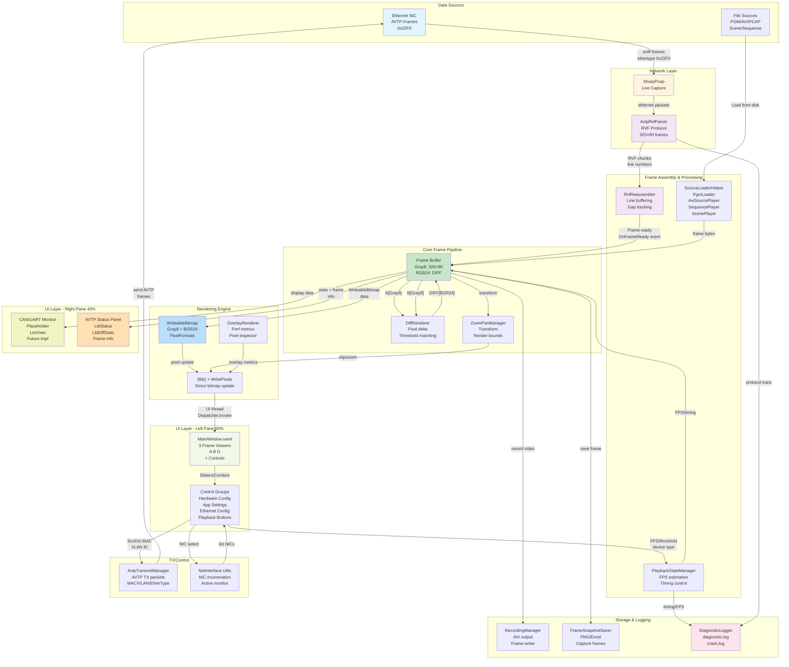

# VilsSharpX - System Architecture Diagram

## Block Diagram



## Color Legend

| Color | Layer | Components |
| ----- | ----- | ---------- |
| Light Blue (`#e1f5ff`) | Data Sources | Ethernet, External input |
| Light Orange (`#fff3e0`) | Network | SharpPcap, Protocol parsing |
| Light Purple (`#f3e5f5`) | Processing | Reassembly, Frame assembly |
| Light Green (`#c8e6c9`) | Core Pipeline | Frame buffer, processing |
| Light Blue (`#bbdefb`) | Rendering | WriteableBitmap, output |
| Light Green (`#f1f8e9`) | UI - Content | Main window, viewers |
| Light Yellow (`#ffe0b2`) | UI - Status | Status panels, monitoring |
| Light Yellow (`#f0f4c3`) | UI - Monitoring | CAN/UART monitor |
| Light Pink (`#fce4ec`) | Support | Logging, diagnostics |

## Key Data Paths

### 1. Live AVTP Capture Path

```text
Ethernet NIC 
  → SharpPcap (sniff ethertype 0x22F0)
  → AvtpRvfParser (decode RVF chunks)
  → RvfReassembler (line-based buffering)
  → Frame Buffer (320×80 Gray8)
  → DiffRenderer
  → WriteableBitmap → UI Display
```

### 2. File Playback Path

```text
PGM/AVI/PCAP/Scene File
  → SourceLoaderHelper / Specialized Players
  → PlaybackStateManager (FPS scheduling)
  → Frame Buffer
  → DiffRenderer
  → WriteableBitmap → UI Display
```

### 3. AVTP TX Path

```text
UI Controls (MAC/VLAN/EtherType inputs)
  → AvtpTransmitManager (packet assembly)
  → Ethernet NIC (transmit frames)
```

---

**Diagram Version**: 1.0  
**Generated**: February 13, 2026  
**Project**: VilsSharpX (WPF .NET 8)
