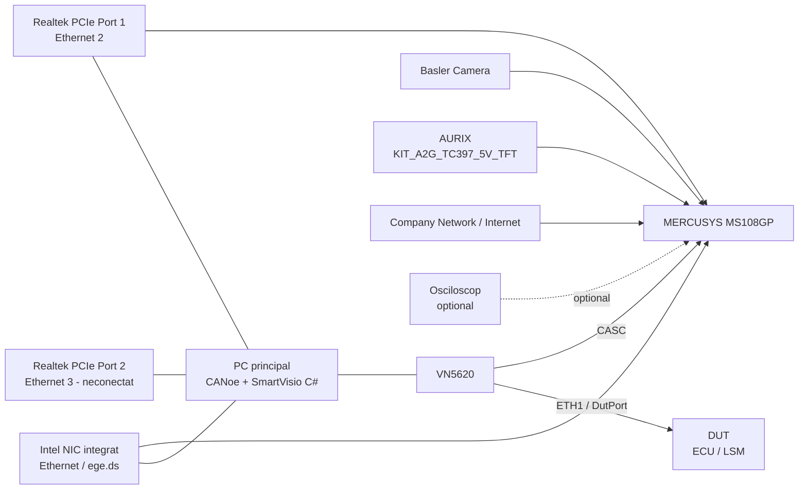

# SmartVisio Lab – Network Topology

## 1. Scop
Acest document descrie topologia actuală de rețea pentru setup-ul de laborator **SmartVisio / CANoe / VN5620 / AURIX / Basler Camera / PC / Switch**.

Documentul poate fi folosit ca referință rapidă pentru:
- conexiunile fizice dintre echipamente;
- maparea porturilor din switch;
- rolul interfețelor de rețea din PC;
- maparea relevantă din CANoe / Vector Hardware Configuration.

---

## 2. Componente principale

### 2.1 PC principal
Pe PC rulează:
- **CANoe**
- **SmartVisio C# application**

Interfețe relevante:
- **USB** către **VN5620**
- **Intel NIC integrat** către switch
- **Realtek PCIe NIC Port 1** către switch
- **Realtek PCIe NIC Port 2** neconectat

---

### 2.2 Vector VN5620 (S/N 8085)
Conexiuni relevante:
- **USB** către PC
- **ETH1** configurat ca **DutPort** și conectat către **DUT**
- **CASC (RJ45)** conectat în switch și configurat în setup ca **Port5 (CASC)**
- **HOST** momentan neutilizat

---

### 2.3 Switch
Model switch:
- **MERCUSYS MS108GP**
- 8 porturi Gigabit
- porturi 1–7 PoE+
- switch **unmanaged**

---

### 2.4 Alte echipamente
- **Basler Camera**
- **AURIX** (KIT_A2G_TC397_5V_TFT)
- **DUT (ECU/LSM)**
- **Company Network / Internet**
- **Osciloscop** (conectat ocazional la unul din porturile libere ale switch-ului)

---

## 3. Topologia generală

### 3.1 Descriere funcțională
- **CANoe** generează trafic **AVTP**.
- Acest trafic este transmis către **DUT** prin **VN5620 ETH1 (DutPort)**.
- Portul **CASC** al VN5620 este conectat în switch și este utilizat în topologia de laborator.
- PC-ul este prezent în rețea prin două adaptoare Ethernet:
  - adaptorul **Intel integrat**;
  - adaptorul **Realtek PCIe Port 1**.
- **Basler Camera**, **AURIX** și conexiunea către **rețeaua companiei** sunt conectate la același switch.

---

## 4. Mapare porturi switch

| Port switch | Dispozitiv / conexiune | Observații |
|---|---|---|
| **1** | Basler Camera | GigE / PoE |
| **2** | AURIX | KIT_A2G_TC397_5V_TFT |
| **3** | VN5620 – CASC (RJ45) | Configurat ca Port5 (CASC) |
| **4** | Neconectat | liber |
| **5** | Neconectat | folosit ocazional pentru osciloscop |
| **6** | PC – Realtek PCIe NIC Port 1 | Windows: **Ethernet 2** |
| **7** | PC – Intel NIC integrat | Windows: **Ethernet / ege.ds** |
| **8** | Company Network / Internet | uplink către rețeaua companiei |

---

## 5. Adaptoare de rețea PC

| Nume în Windows | Adaptor fizic | Conectare | Observații |
|---|---|---|---|
| **Ethernet / ege.ds** | Intel(R) Ethernet Connection (17) I219-LM | Switch Port 7 | conectivitate companie |
| **Ethernet 2** | Realtek PCIe GbE Family Controller | Switch Port 6 | utilizat în setup / CANoe |
| **Ethernet 3** | Realtek PCIe GbE Family Controller #2 | Neconectat | port liber |

---

## 6. Mapare relevantă CANoe / Vector

### 6.1 Vector VN5620
- **ETH1** → **DutPort** → conectat la **DUT**
- **CASC (RJ45)** → **Port5 (CASC)** → conectat la **Switch Port 3**
- **HOST** → neutilizat

### 6.2 CANoe Port Configuration
În configurația CANoe există două zone relevante:

#### MAIN
- `DutPort`
- `Port5`
- alte porturi logice pentru rețeaua principală de laborator

#### SmartVisio
- `NDIS_Port1`
- acesta corespunde adaptorului **Realtek PCIe** conectat la **Switch Port 6**

---

## 7. Diagramă text

```text
                              +-----------------------------------+
                              |               PC                  |
                              |-----------------------------------|
                              | CANoe + SmartVisio C#            |
                              |                                   |
                              | Intel NIC integrat  ------------+-------> Switch Port 7
                              | Realtek PCIe Port 1 -----------+-------> Switch Port 6
                              | Realtek PCIe Port 2             |        (neconectat)
                              +----------------+----------------+
                                               |
                                               | USB
                                               v
                                        +------+------+
                                        |   VN5620    |
                                        |-------------|
                                        | ETH1        +-------> DUT
                                        | (DutPort)   |
                                        | CASC RJ45   +-------> Switch Port 3
                                        | HOST unused |
                                        +-------------+

          +------------------------------------------------------------------+
          |                       MERCUSYS MS108GP                           |
          |------------------------------------------------------------------|
          | Port 1 -> Basler Camera                                          |
          | Port 2 -> AURIX                                                  |
          | Port 3 -> VN5620 CASC                                            |
          | Port 4 -> liber                                                  |
          | Port 5 -> liber / osciloscop ocazional                           |
          | Port 6 -> PC Realtek PCIe Port 1                                 |
          | Port 7 -> PC Intel NIC integrat                                  |
          | Port 8 -> rețea companie / internet                              |
          +------------------------------------------------------------------+
```

---

## 8. Diagramă Mermaid



---

## 9. Fluxuri relevante

### 9.1 Flux AVTP către DUT
Fluxul principal este:

**CANoe → VN5620 → ETH1 (DutPort) → DUT**

### 9.2 Conectivitatea de laborator prin switch
În switch intră:
- Basler Camera
- AURIX
- VN5620 CASC
- PC Intel NIC
- PC Realtek NIC Port 1
- Company Network / Internet

---

## 10. Observații importante

1. **Portul 2** din switch este conectat la **AURIX**.
2. **Portul 3** din switch este conectat la **VN5620 CASC**.
3. **Portul 6** din switch este conectat la **Realtek PCIe Port 1** din PC.
4. **Portul 7** din switch este conectat la **Intel NIC integrat** din PC.
5. **Portul 8** din switch este uplink către **rețeaua companiei / internet**.
6. **Porturile 4 și 5** sunt în mod normal libere; unul dintre ele poate fi folosit ocazional pentru conectarea osciloscopului.
7. Switch-ul **MERCUSYS MS108GP** este **unmanaged**, deci **nu suportă port mirroring configurabil**.
8. **Realtek PCIe Port 2** este momentan neutilizat.

---

## 11. Rezumat rapid

### Porturi switch
- P1 → Basler Camera
- P2 → AURIX
- P3 → VN5620 CASC
- P4 → liber
- P5 → liber / osciloscop ocazional
- P6 → PC Realtek PCIe Port 1
- P7 → PC Intel NIC integrat
- P8 → Company Network / Internet

### Conexiuni VN5620
- USB → PC
- ETH1 → DUT
- CASC → Switch Port 3
- HOST → neutilizat

### Rețea PC
- Intel NIC → Switch Port 7
- Realtek Port 1 → Switch Port 6
- Realtek Port 2 → neconectat

---

## 12. Fișiere asociate recomandate în documentație
Se recomandă păstrarea împreună cu acest document a următoarelor:
- diagrama grafică de topologie;
- capturi din **Vector Hardware Manager**;
- capturi din **CANoe Port Configuration**;
- capturi din **Windows Network Settings**;
- eventuale note privind IP-urile folosite în teste.

---

## 13. Istoric / metadata document
- **Document**: SmartVisio Network Topology Documentation
- **Autor**: Costi Raducan
- **Versiune**: 1.0
- **Status**: Working documentation

